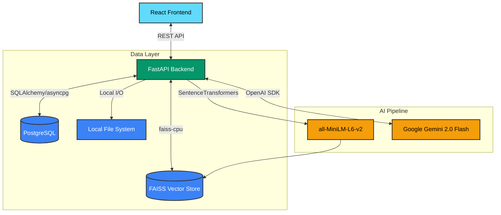
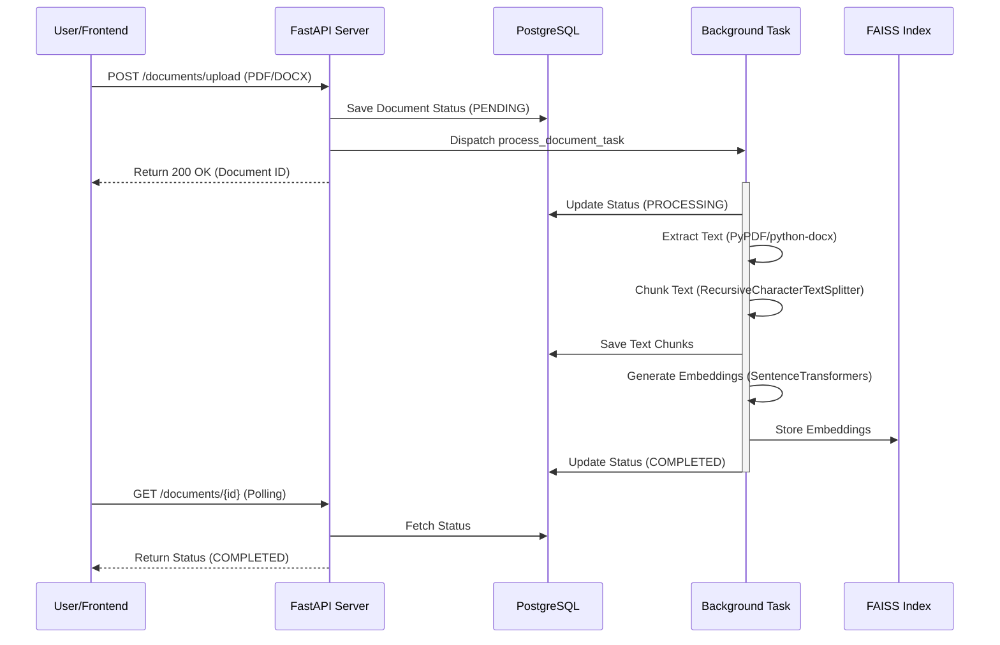
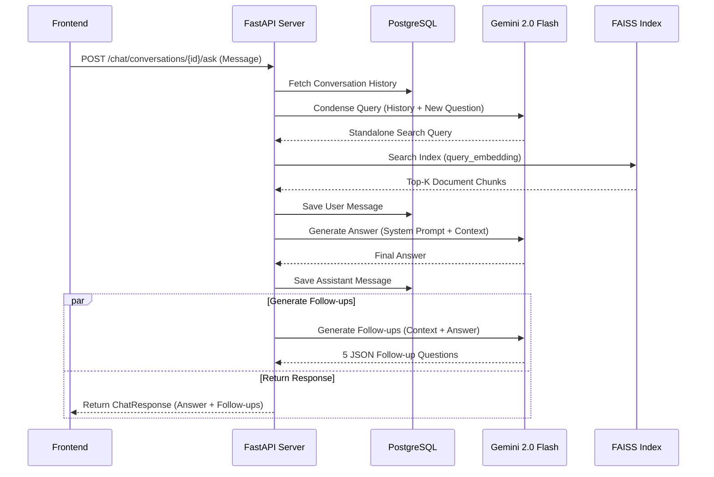
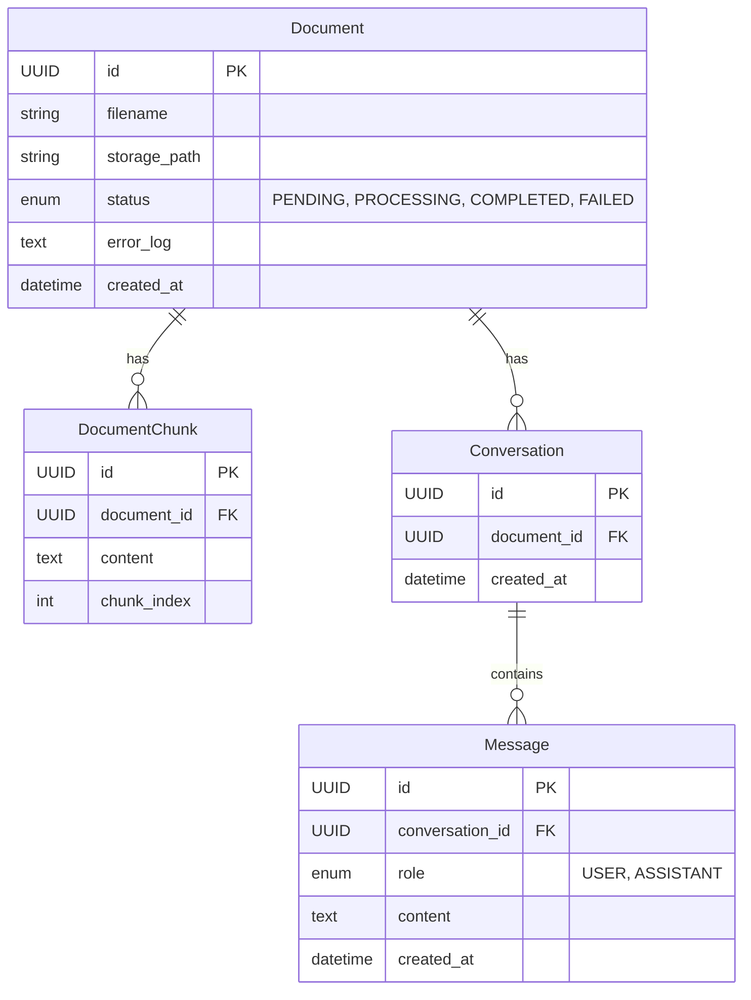

# Askdoc System Architecture & Design

This document describes the technical architecture and data flows of the Askdoc Retrieval-Augmented Generation (RAG) system.

## 🧱 Component Architecture

The system is composed of decoupled services, allowing the UI to remain responsive while heavy AI tasks process asynchronously in the background.



### 1. Frontend (React + TypeScript)
- **Framework:** Vite-powered React application.
- **State Management:** React Hooks (useState, useEffect, useCallback) for local and session state.
- **Communication:** `fetch` based API client for interacting with the FastAPI backend.
- **Key Features:** Real-time document status polling, markdown rendering for chat, and session persistence via `localStorage`.

### 2. Backend (FastAPI)
- **API Framework:** FastAPI for high-performance asynchronous request handling.
- **Task Management:** Utilizes FastAPI's `BackgroundTasks` for offloading CPU-intensive document processing.
- **ORM:** SQLAlchemy with `asyncpg` for asynchronous database operations.
- **Migration:** Alembic for database schema versioning.

### 3. Data Storage
- **Relational DB (PostgreSQL):** Stores document metadata, chunk text, conversation threads, and message history (strict chronological ordering).
- **Vector Store (FAISS):** Stores high-dimensional vector embeddings of document chunks for efficient similarity search.
- **File System:** Local storage for uploaded PDF and DOCX files.

### 4. AI & ML Pipeline
- **Embedding Model:** `SentenceTransformers/all-MiniLM-L6-v2` - chosen for its balance between performance and low resource consumption on CPUs.
- **LLM:** `Google Gemini 2.0 Flash` - used for natural language understanding, question condensation, and final response generation.
- **Text Splitter:** `RecursiveCharacterTextSplitter` from LangChain, configured with 1000-character chunks and 100-character overlap.

---

## 🔄 System Workflows

### 1. Document Ingestion Flow

When a user uploads a document, the API immediately returns a response while vectorization happens in a background thread to keep the server non-blocking.



### 2. Q&A / Retrieval Flow

The chat flow implements an advanced RAG pattern that involves query condensation and parallel execution for optimal speed.



## 🗄️ Database Schema (ERD)

The relational data is stored in PostgreSQL. Below is the Entity-Relationship Diagram representing the core data models.



## 📁 Project Structure

```text
Askdoc/
├── app/                      # FastAPI Backend Application
│   ├── api/v1/endpoints/     # REST API route handlers (chat, documents)
│   ├── core/                 # App configuration and environment variables
│   ├── db/                   # Database session and base models
│   ├── models/               # SQLAlchemy ORM models
│   ├── schemas/              # Pydantic validation schemas
│   └── services/             # Core business logic (RAG, FAISS, LLM integration)
├── frontend/                 # React + Vite Frontend Application
│   ├── public/               # Static assets
│   └── src/                  # React components, hooks, and API client
├── media/                    # Local storage for uploaded PDF/DOCX files
├── migrations/               # Alembic database migration scripts
├── vector_store/             # FAISS local index and metadata files
├── docker-compose.yml        # Multi-container orchestration
├── Dockerfile                # Backend container definition
└── main.py                   # FastAPI application entry point
```

## 🛠️ Technology Stack Decisions

- **Why FAISS over pgvector?** While the project includes `pgvector` dependencies, the current implementation uses FAISS to ensure maximum performance for local similarity searches and to adhere to a CPU-optimized local vector store pattern.
- **Why BackgroundTasks?** Using FastAPI's native background tasks allows the system to remain responsive without the overhead of a full Celery/Redis setup for simpler deployments.
- **Why Gemini 2.0 Flash?** It provides exceptional speed and accuracy for RAG tasks, especially for the "condensation" and "follow-up" steps where low latency is critical to the user experience.
