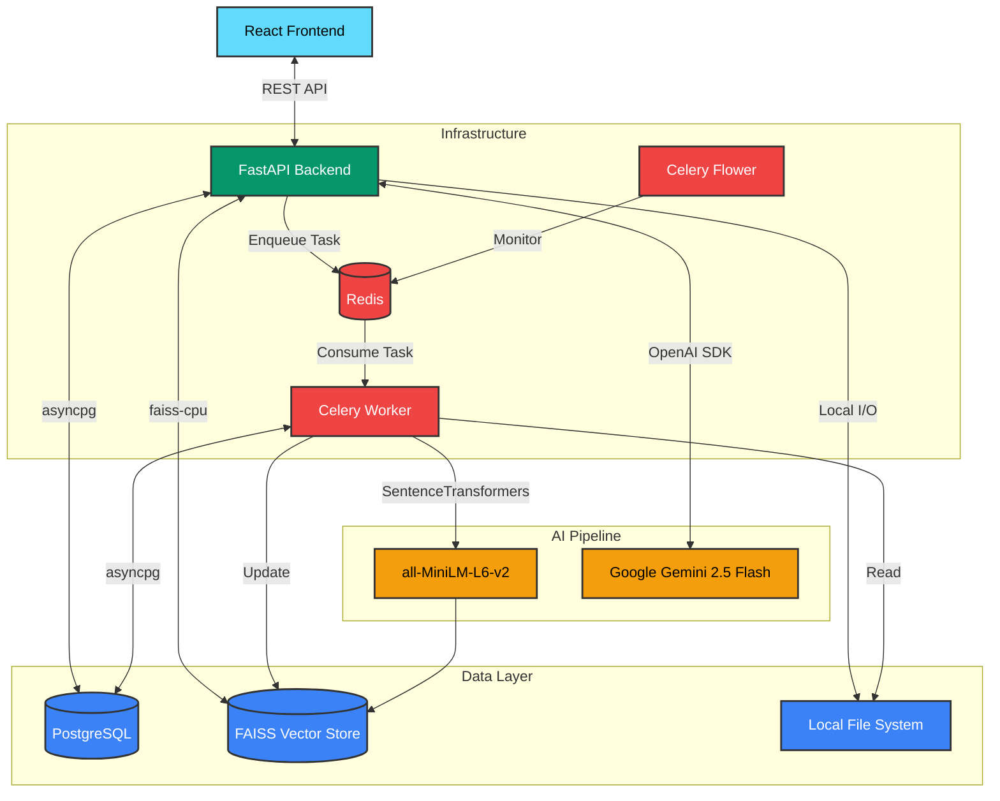
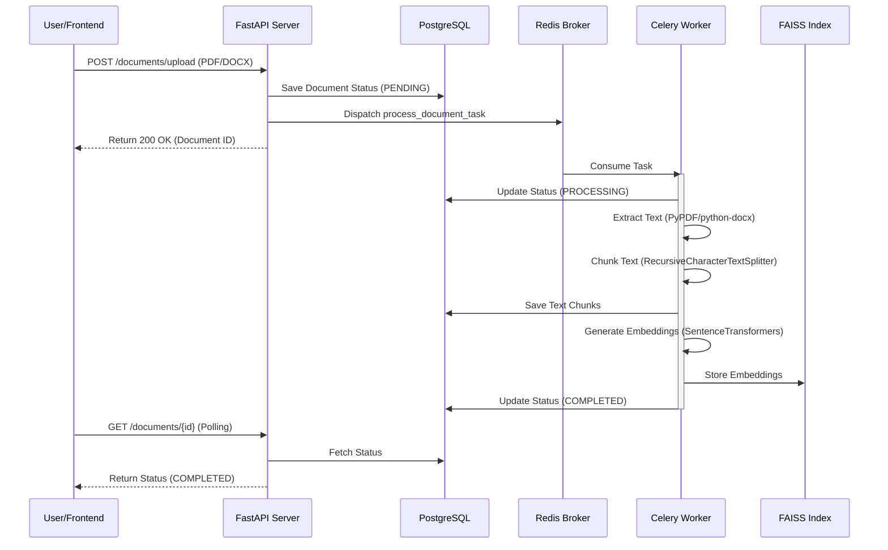
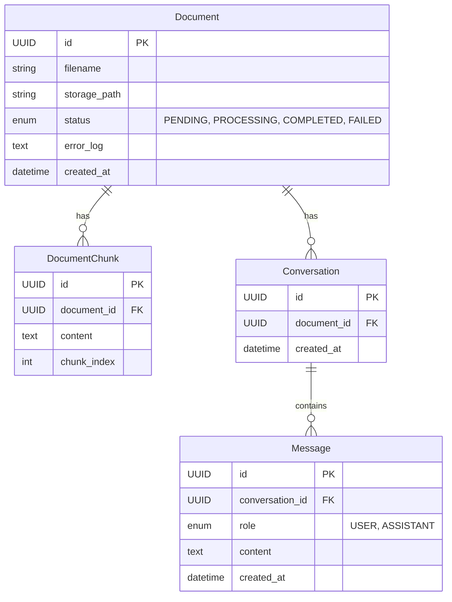

# Askdoc System Architecture & Design

This document describes the technical architecture and data flows of the Askdoc Retrieval-Augmented Generation (RAG) system. The system is designed for high concurrency, utilizing a distributed task queue for heavy AI processing.

## 🧱 Component Architecture

The system is composed of decoupled services, allowing the UI and API to remain lightning-fast and responsive while heavy AI tasks (text extraction, chunking, and embedding) are processed asynchronously by background workers.

### 1. Frontend (React + TypeScript)
- **Framework:** Vite-powered React application.
- **State Management:** React Hooks (useState, useEffect, useCallback) for local and session state.
- **Communication:** `fetch` based API client.
- **Key Features:** Real-time document status polling, markdown rendering, and session persistence via `localStorage`.

### 2. Backend (FastAPI)
- **API Framework:** FastAPI for high-performance asynchronous request handling.
- **ORM:** SQLAlchemy with `asyncpg` for asynchronous database operations.
- **Migration:** Alembic for database schema versioning.

### 3. Distributed Task Queue (Celery + Redis)
- **Broker (Redis):** Acts as the message broker, securely holding tasks dispatched by FastAPI until a worker is ready.
- **Worker (Celery):** Runs in a separate isolated container. It consumes tasks from Redis and executes CPU-bound operations without blocking the API event loop.
- **Monitor (Flower):** Provides a web-based dashboard for real-time monitoring of Celery clusters, tracking task success rates, execution times, and worker health.

### 4. Data Storage
- **Relational DB (PostgreSQL):** Stores document metadata, chunk text, conversation threads, and message history (strict chronological ordering).
- **Vector Store (FAISS):** Stores high-dimensional vector embeddings of document chunks for efficient similarity search.

### 5. AI & ML Pipeline
- **Embedding Model:** `SentenceTransformers/all-MiniLM-L6-v2` - Baked directly into the Docker image for instant startup.
- **LLM:** `Google Gemini 2.5 Flash` - Used for natural language understanding, question condensation, and final response generation.
- **Text Splitter:** `RecursiveCharacterTextSplitter` from LangChain, configured with 1000-character chunks and 100-character overlap.

---

## 🔄 System Workflows

### 1. Document Ingestion Flow (Distributed)

When a user uploads a document, the API immediately returns a response while vectorization happens in an isolated Celery worker container.

### 2. Q&A / Retrieval Flow

---

## 🗄️ Database Schema (ERD)

## 🛠️ Technology Stack Decisions

- **Why Celery & Redis?** Offloading ML tasks (chunking and embeddings) ensures the API remains completely non-blocking. If 100 users upload PDFs simultaneously, the API stays responsive while Redis queues the jobs for the Celery workers to handle systematically. This is the gold standard for production-grade asynchronous processing.
- **Why FAISS over pgvector?** While the project includes `pgvector` dependencies, the current implementation uses FAISS to ensure maximum performance for local similarity searches and to adhere to a CPU-optimized local vector store pattern.
- **Why Gemini 2.5 Flash?** It provides exceptional speed and accuracy for RAG tasks, especially for the "condensation" and "follow-up" steps where low latency is critical to the user experience.
